<h1 align="center"> Car Dekho Used Car Prediction </h1>

# Table of Contents

- [Problem Statement](#1-problem-statement)
- [About The Dataset](#2-about-the-dataset)
- [Tools and Technology](#3-tools-and-technology)
- [Visualization](#4-visualizations)
    - [Most Selling Used Car](#41-most-selling-used-car)
    - [Most Selling Brand](#42-most-selling-brand)
    - [Costliest Brand vs Selling Price](#43-costliest-brand-vs-selling-price)
    - [Costliest Car vs Selling Price](#44-costliest-car-vs-selling-price)
    - [Most Mileage vs Brand Name](#45-most-mileage-vs-brand-name)
    - [Best Mileage vs Car Name](#46-best-mileage-vs-car-name)
    - [KM Driven vs Selling Price](#47-km-driven-vs-selling-price)
    - [Fuel Type Selling Price](#48-fuel-type-selling-price)
    - [Most Sold Fuel Type](#49-most-sold-fuel-type)
    - [Fuel Type vs Mileage](#410-fuel-type-vs-mileage)
    - [Mileage vs Selling Price](#411-mileage-vs-selling-price)
    - [Vehicle Age vs Selling Price](#412-vehicle-age-vs-selling-price)

## 1. Problem Statement
This dataset comprises used cars sold on cardehko.com in India as well as important features of these cars.
If user can predict the price of the car based on input features.
Prediction results can be used to give new seller the price suggestion based on market condition.

## 2. About The Dataset
- The Dataset is collected from scrapping from cardheko.com
- The data consists of 13 column and 15411 rows.

## 3. Tools and Technology

- Python with Jupter Notebook
- Numpy - It provides a fast numerical array structure and operating functions.
- Pandas - It provides tools for data storage, manipulation and analysis tasks.
- Matplotlib - It is the basic plotting library in Python. It provides tools for making plots.
- Seaborn - It is also used in visualization.
- Scikit learn - The required machine learning library in Python.

## 4. Visualizations

### 4.1 Most Selling Used Car

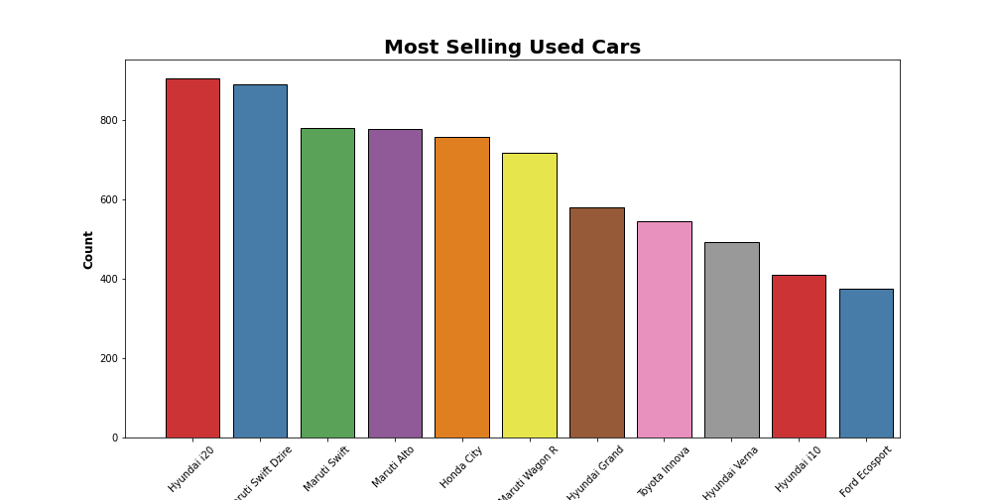

### 4.2 Most Selling Brand

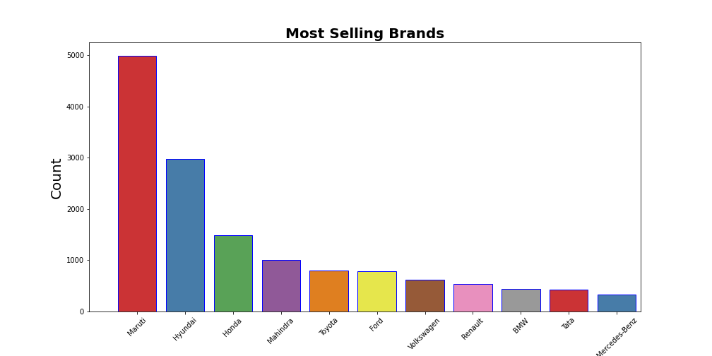

### 4.3 Costliest Brand vs Selling Price

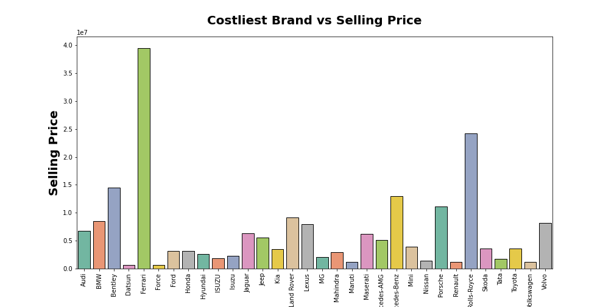

### 4.4 Costliest Car vs Selling Price

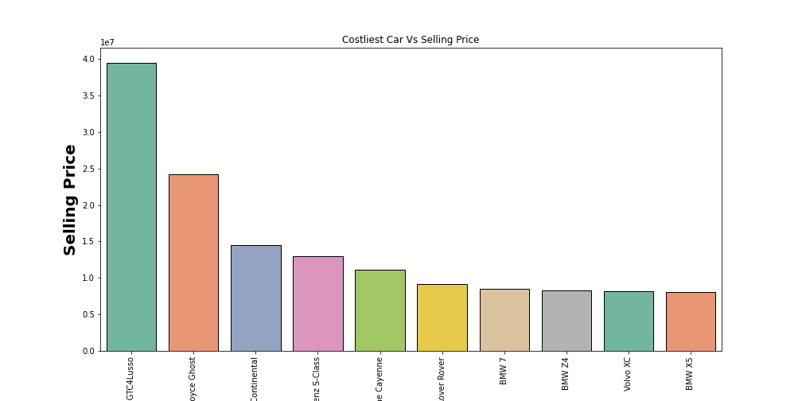

### 4.5 Most Mileage vs Brand Name

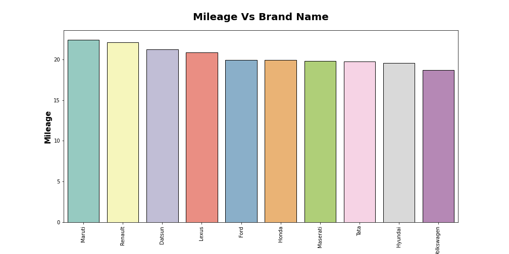

### 4.6 Best Mileage vs Car Name

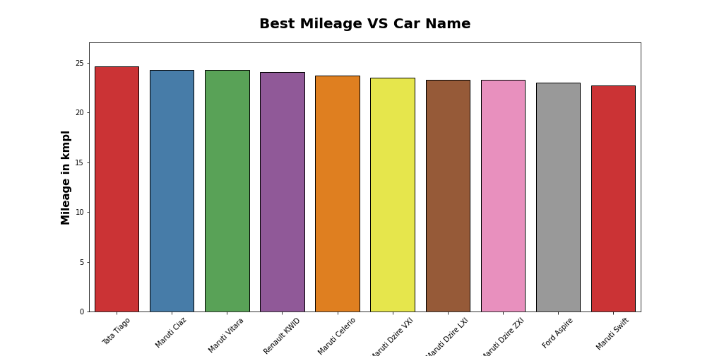

### 4.7 KM Driven vs Selling Price

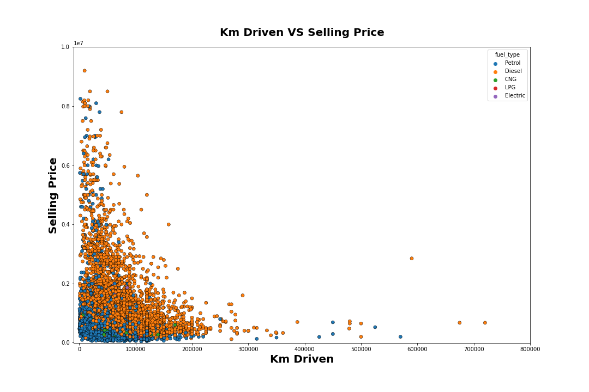

### 4.8 Fuel Type Selling Price

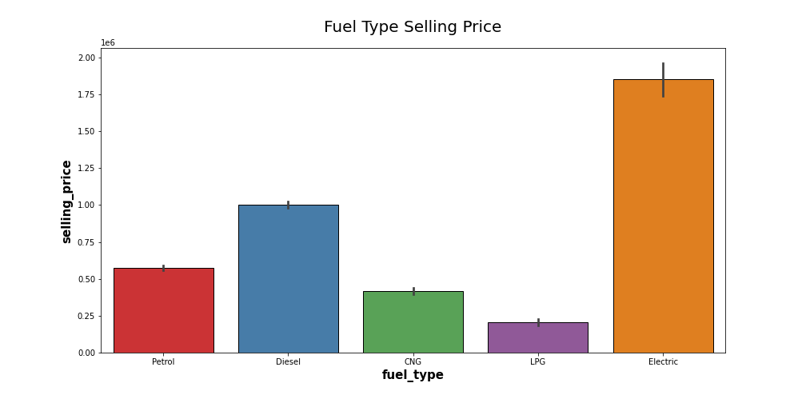

### 4.9 Most Sold Fuel Type

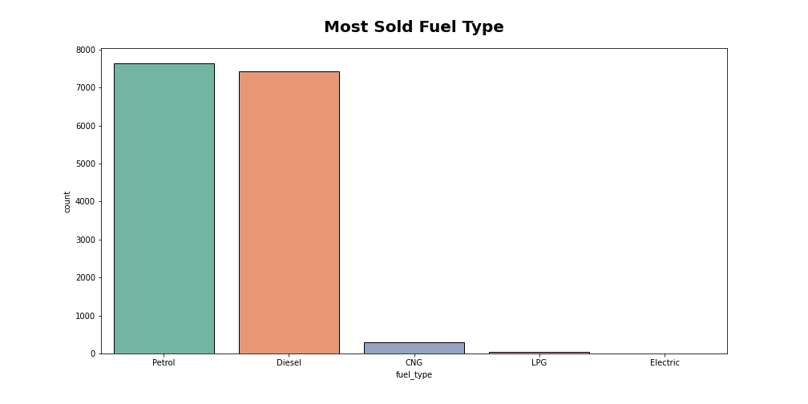

### 4.10 Fuel Type vs Mileage

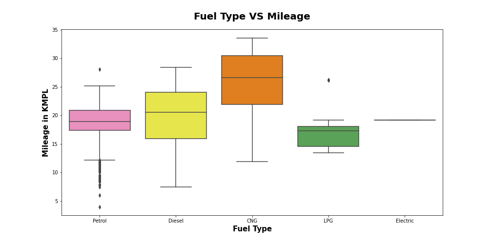

### 4.11 Mileage vs Selling Price

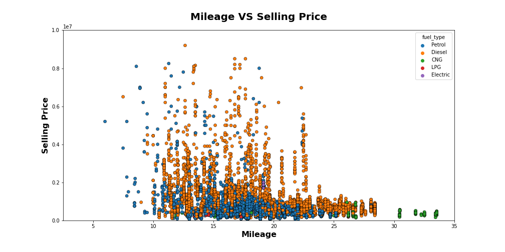

### 4.12 Vehicle Age vs Selling Price

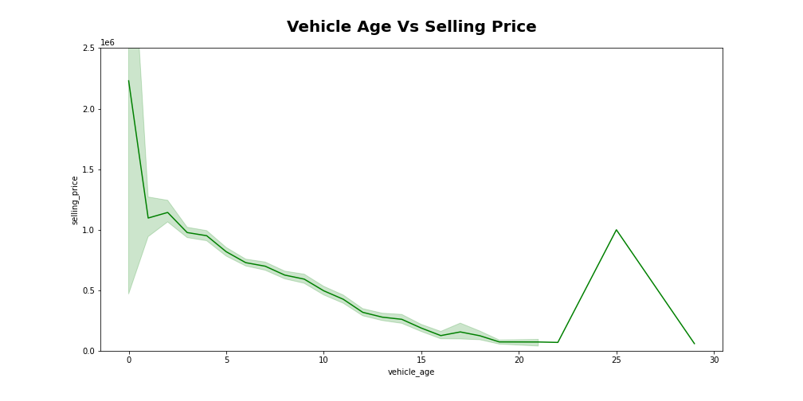

## 5. Conclusions

- The datatypes and Column names were right and there was 15411 rows and 13 columns
- The `selling_price` column is the target to predict. i.e Regression Problem.
- Dealers are the highest sellers of the used cars.
- Vehicle age has negative impact on the price.
- Manual cars are mostly sold and automatic has higher selling average than manual cars.
- Petrol is the most preffered choice of fuel in used car website, followed by diesel and LPG.
- We just need less data cleaning for this dataset.

